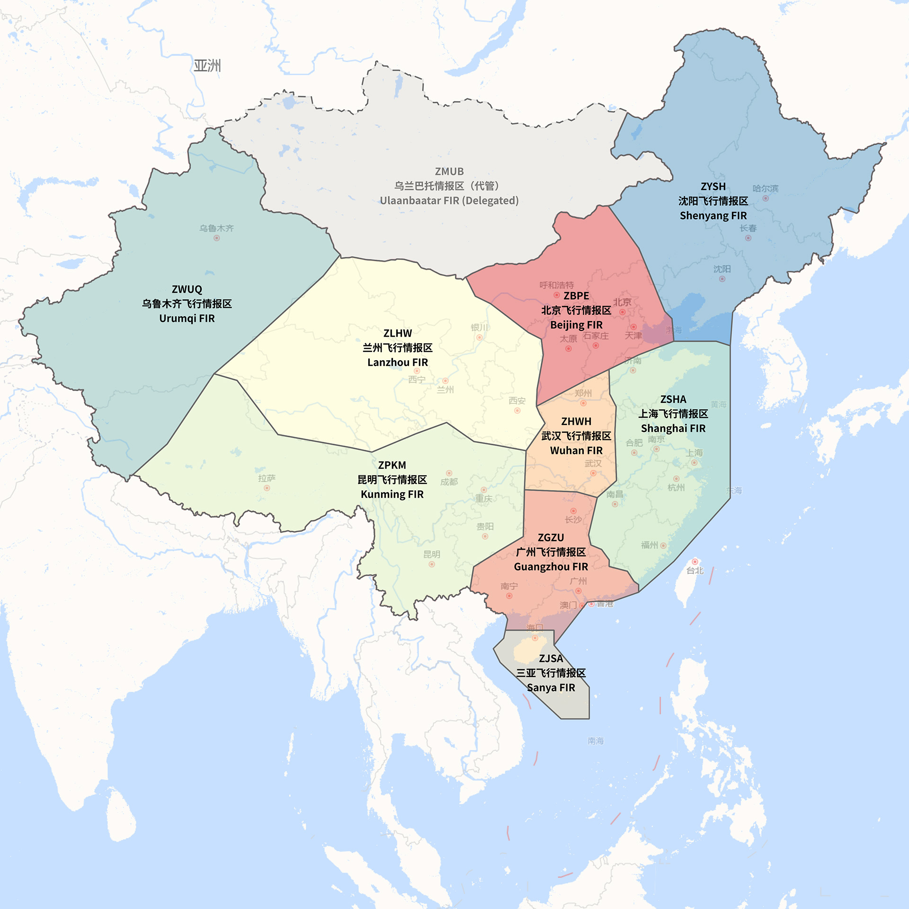

# Skylite 开源扇区 (中国大陆)
**由于中国港澳台地区使用不同的飞行规则，我们暂时没有制作相关扇区，预计在AIRAC2501能完善港澳台地区的扇区**

Skylite 开源扇区项目致力于提供免费、开源的 Euroscope 扇区以帮助来自世界各地的模拟管制爱好者获得更好的模拟飞行体验。

如果您在使用扇区的过程中遇到了任何问题、或者有任何好的建议，欢迎在 ``Issues`` 页向我们提出！

如果您喜欢本扇区，欢迎您给扇区点点``Star``, 或者在下方赞赏我们，您的支持是我们更新的动力！

------

本扇区虽名为Skylite开源扇区，但本质为AirAmaz-Sector的衍生物，按照[GPL-3.0 许可证](./LICENSE)进行开源处理。

如果你想加入Skylite模拟飞行平台，请加入QQ群聊：[1041264930](https://qm.qq.com/q/nch2dkleX6)

------

### 飞行情报区

*注：此图转自https://www.vatprc.net/zh-cn/airspace/fir*

> [!NOTE]
>
> VATPRC对于情报区划分并不一定与真实世界中的情报区划分完全一致。
>
> 为避免争议，上述示意图仅为 VATPRC**主要**管辖范围。
>
> 请勿误将其当作真实中的情报区划分。

| 情报区名称 | 导航数据版本 |
| ---------- | ------------ |
| ZBPE       | AIRAC2413    |
| ZGZU       | AIRAC2413    |
| ZHWH       | AIRAC2413    |
| ZJSA       | AIRAC2413    |
| ZLHW       | AIRAC2413    |
| ZPKM       | AIRAC2413    |
| ZSHA       | AIRAC2413    |
| ZWUQ       | AIRAC2413    |
| ZYSH       | AIRAC2413    |

------

### 前置要求
1. 为保证扇区能够正常加载，您需要安装最新的 Microsoft Visual C++ (x86) 可再发行程序包版本: 
   - https://aka.ms/vs/17/release/vc_redist.x86.exe
2. 同时您需要安装 DirectX Runtime 以支持我们的渲染库运行: 
   - https://www.microsoft.com/en-us/download/details.aspx?id=35

------

### 包含插件

| 插件名称                    | 主要作者                                                     |
| --------------------------- | ------------------------------------------------------------ |
| TopSky Plugin(闭源)         | [Juha Holopainen](https://forum.vatsim-scandinavia.org/u/839337) |
| Ground Radar plugin(闭源)   | [Juha Holopainen](https://forum.vatsim-scandinavia.org/u/839337) |
| MTEPlugin for EuroScope     | [KingfuChan](https://github.com/KingfuChan)                  |
| VCH Plugin                  | [Jan Fries](https://github.com/DrFreas)                      |
| Compass for Euroscope(闭源) | [William He](https://github.com/Misaka-Nnnnq)                |
| AirAmaz RenderPlugin(闭源)  | [William He](https://github.com/Misaka-Nnnnq)                |

------

### 外部内容

| 名称                | 来源                                                         |
| ------------------- | ------------------------------------------------------------ |
| TopSky Symbols      | [uk-controller-pack](https://github.com/VATSIM-UK/uk-controller-pack) |
| TopSky Cursors      | [VATPRC](https://www.vatprc.net/)                            |
| AircraftPerformance | [VATSIM](https://github.com/vatsimnetwork/euroscope-performance-data) |

------

### 更新日志

按照[GPL-3.0 许可证](./LICENSE)要求，我们已经将更新日志将会记录在[CHANGELOG.md](./CHANGELOG.md)上面

文章开头的注释由于本人在制作时没有及时察觉此问题，我们将在近期进行补全

------

### 贡献者

- [William He](https://github.com/fwilliamhe)
- [Bradley.L](https://github.com/BradleyLu)
- [天真永不消逝](https://github.com/shiguanglindi)
- [Yifan Jin](https://github.com/N28888)
- [8305](https://github.com/wvemil)
- [fulkarl](https://github.com/fulkarl)
- [Dapeng Liu](https://github.com/DapengLiu01)
- [Final.]()
- [tn.]()
- [Zihan Wang]()
- [Master Gui](https://github.com/supermastergui)

------

### 声明
本项目可能包含来源于公开互联网资源的数据或信息。

所有此类内容均为其各自所有者的知识产权。

使用这些资源仅限于教育和非商业目的，并遵守适用的版权法律。

如果您是所使用内容的所有者并希望其被移除或获得适当的署名，请与我们联系，我们将采取相应措施。
